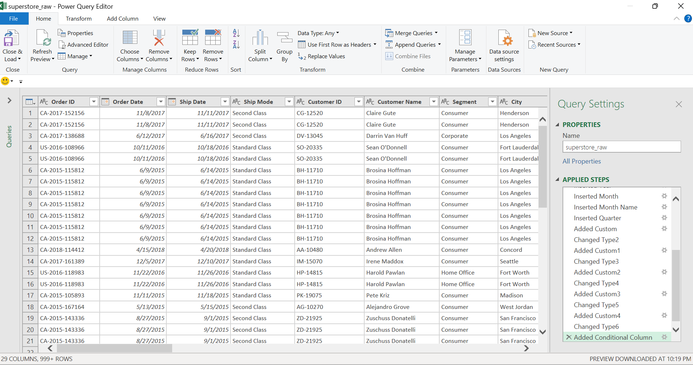
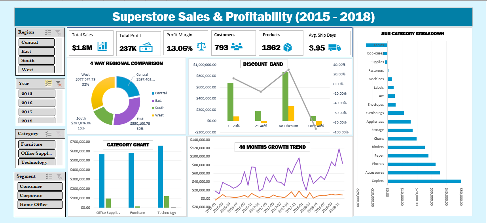

# Superstore Sales & Profitability Dashboard

This dashboard addresses a key business question: revenue has grown steadily
over 4 years across 5,009 orders, 793 customers, and 1,862 products, but very
little of that growth has translated into profit. The analysis breaks down
performance by customer segment, product category, and discount behaviour to
identify where margin is being lost.

## Dataset

[Sample Superstore — retail transactions 2015–2018](https://raw.githubusercontent.com/leonism/sample-superstore/master/data/superstore.csv): a public retail dataset covering orders, products, customers, regions, discounts and profit.

Data volume:

- Raw file: 10,800 rows × 21 columns
- After cleaning: 9,994 valid transactions (806 junk rows removed — the source file had two unrelated sheets pasted beneath the order data)
- After feature engineering: 9,994 rows × 29 columns (10 engineered)
- Coverage: 5,009 orders · 793 customers · 1,862 products · 4 years

## Method

1. **Import (Power Query)**: Loaded the raw CSV directly into Power Query without opening it in Excel first, preserving data types and preventing auto-formatting corruption
2. **Cleaning (Power Query)**: Removed the 806 junk rows by typing `Row ID` as a whole number and dropping conversion errors — a self-documenting rule rather than a hardcoded row count. Parsed US-format dates using explicit locale settings; typed postal codes as text to preserve leading zeros
3. **Feature engineering (Power Query)**: Built 10 new columns not present in the raw export — `Discount Band`, `Profit Margin`, `Profit Status`, `Shipping Days`, `Unit Price`, `Year-Month`, `Order Year`, `Month Number`, `Month Name`, `Quarter`
4. **Analysis (Pivot Tables)**: Six pivots covering KPIs, monthly trend, category, sub-category, discount band and region, with a calculated field for correctly weighted margin
5. **Dashboard (Excel)**: Interactive report with four cross-connected slicers filtering every visual simultaneously

Every transformation step is documented and reproducible in the query itself:

## Key Results

**Headline: $2.30M in sales produced only $286K profit — a 12.47% margin.**

The engineered features, not the raw columns, produced every finding below. The raw export contains a `Discount` column of decimals like 0.32 — analytically useless on its own. Banding it into `Discount Band` exposed the central problem in a single chart:

| Discount Band | Sales | Profit | Margin |
|---|---|---|---|
| No Discount | $1,087,908 | $320,988 | **+29.51%** |
| 1–20% | $846,522 | $100,785 | +11.91% |
| 21–40% | $234,138 | −$35,817 | **−15.30%** |
| Over 40% | $128,632 | −$99,559 | **−77.40%** |

**Every discount above 20% destroys value.** Deep discounting cost $135,376 in profit across the period. Had those same sales achieved even the 1–20% band's margin, the swing would be roughly $178,000.

Further findings, all surfaced by engineered columns:

- **`Profit Status` flag**: 1,871 transactions (18.7%) were loss-making — nearly one line item in five
- **Category margin**: Furniture generated $742,000 in sales but only $18,451 profit (**2.49%**), against Technology's **17.40%** and Office Supplies' **17.04%**
- **Three sub-categories lose money outright**: Tables (−$17,725), Bookcases (−$3,473), Supplies (−$1,189)
- **Regional gap**: Central runs 7.92% margin against West's 14.94% — nearly double
- **Growth is real**: sales rose 51% from $484,247 (2015) to $733,215 (2018), which makes the margin leakage more costly, not less

## Business implications

- **Cap discounts at 20%.** The data shows no profitable transaction band above it. This single policy change addresses $135,376 of realised losses
- **Review the Furniture category, starting with Tables.** A 2.49% margin on the second-largest sales category suggests pricing or freight costs are not covering themselves
- **Investigate Central region.** A 7-point margin gap against West on comparable volume points to either discounting behaviour or cost structure differences worth isolating
- **Treat the 18.7% loss-making transactions as a review list**, not a rounding error — they are concentrated, not random

## Tech Stack

Data preparation: Power Query (M)
Analysis: Excel Pivot Tables · Calculated Fields
Visualisation: Excel Pivot Charts · Slicers
Interactivity: Four cross-connected slicers (Region, Year, Category, Segment)

## Files

- `superstore_dashboard.xlsx` — full interactive workbook: cleaned data, six pivots, live dashboard
- `superstore_dashboard.png` — dashboard screenshot
- `superstore_cleaneddata.xlsx` — the cleaned and feature-engineered dataset (9,994 rows × 29 columns), for anyone who wants to reuse it without rebuilding the pipeline
- `powerquery_datatransform.png` — screenshot of the full Power Query transformation steps
- `README.md` — this file

## How to reproduce

1. Open `superstore_dashboard.xlsx` and use **Data → Refresh All** to re-run the full Power Query pipeline
2. Every cleaning and feature engineering step is visible and editable in **Data → Queries & Connections → Edit**
3. To skip the pipeline entirely, use `superstore_cleaneddata.xlsx` — already cleaned and ready for analysis
4. The Pivots sheet is hidden by default — right-click any tab → Unhide to inspect the underlying tables

## Learnings

- **Feature engineering is where the analysis actually happens.** The raw export could not answer "are our discounts working?" — the `Discount Band` column could. Ten engineered columns produced every insight in this dashboard; the original 19 produced none on their own.
- **Never average a ratio.** Averaging the row-level `Profit Margin` column returns 12.03%; total profit ÷ total sales returns the correct 12.47%. Averaging treats a $3 order as equal to a $3,000 one, so the calculated field does the weighting properly.
- **Cleaning rules should be self-documenting.** Filtering on "Row ID must be a valid number" explains itself to the next reader; "keep top 9,994 rows" does not, and breaks silently if the source changes.
- **Locale matters more than it looks.** US-format dates (MM/DD/YYYY) read on a UK or Nigerian locale silently turn 8 November into 11 August. Setting locale explicitly at import prevents a class of error that never announces itself.

## Next steps

- Build a customer-level RFM (Recency: How recently a customer purchased, Frequency: How often a customer purchases, Monetary: How much a customer spends) segmentation to identify which customers are driving the loss-making transactions
- Add a shipping cost proxy to test whether Furniture's thin margin is a freight problem rather than a pricing one
- Extend the discount analysis by sub-category to find where the deep discounting is actually originating

---

Built by Lois Opadeji | [LinkedIn](https://linkedin.com/in/loisopadeji) | [GitHub](https://github.com/loisopadeji)
